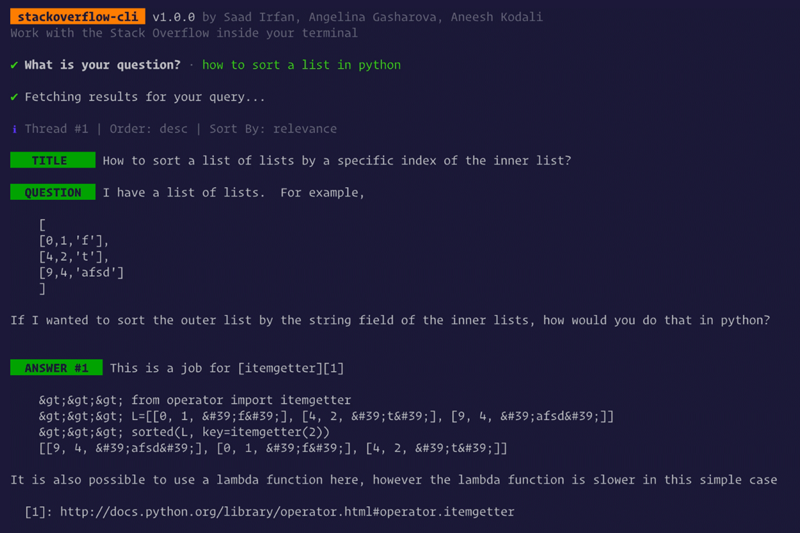
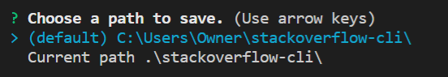
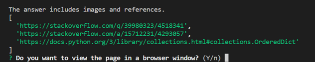

<div align="center">
	<b>Search any query on Stack Overflow without leaving your IDE</b>
	<br>
	
	
	
</div>

# 💥 stackoverflow-cli

- Search any query inside your terminal
- Top 10 threads
- Order the results in ascending/descending order
- Sort the results via relevance/votes/activity/creation

## Project Description

This is a project to create a CLI-type search program equipped with a function that searches for or manages development errors on the terminal and automatically records solutions.

The project is based on stackoverflow-cli (https://github.com/MLH-Fellowship/stackoverflow-cli) and proceeds in the direction of improving the program by modifying existing functions and adding functions.

## Function

### Modified function 

**1. Improved special character output**

The following is the result of executing stackoverflow-cli.



   If you look at the ANSWER part, you can see that the special characters are not converted and the character entity code is output as it is. Therefore, by modifying the special character conversion process, the special characters were printed properly, helping users to better understand the contents.

**2. Improved output of results**

   In stackoverflow, many users mark key keywords or write code using formats such as inline code and block code when writing questions and answers. Therefore, the output format has been modified so that inline and block code formats can be distinguished when outputting questions and answers on the terminal.

### Additional functions

**1. Save selected questions and answers**

   When the same error occurs multiple times, we want to reduce the number of searches for the same error because we can't remember the solution we used before. Therefore, the problem including the error message and the solution used to solve the problem should be recorded together so that it can be referred to when a similar error occurs. 




**2. Open browser automatically when an image is attached to the content**

   If you look at the stackoverflow site, images are sometimes attached to questions and answers. Since the image cannot be displayed in the terminal, the image link is attached in this case in the existing stackoverflow-cli program. In other words, it is not possible to view the image and text together, and there is a hassle of having to open and check the image link separately. To improve this inconvenience, when an image is attached, a browser window is launched so that the user can check the image and text at the same time.

   However, since the project is a CLI program, there is a possibility to use it in an environment that does not support GUI. Therefore, when an image is attached, the browser is executed when the user presses the 'b' key on the keyboard, and the corresponding function can be executed only when the user wants it.




## User guide

Run the CLI program by entering the following command in the terminal

```sh
$ node index.js
```

### 📃How to use

- Right → key – Next thread
- Left ← key – Previous thread
- Up ↑ key – Next Answer
- Down ↓ key – Previous Answer
- 's'  key - Save selected questions and answers
- 'b' key -  Launch browser window

### 🏳 Flags

```
# CLI help
stack --help
```


```sh
# Order results in ascending order
stack --asc

# Sort results according to the most activity
stack --activity

# Sort results according to  votes
stack --votes

# Sort results according to the creation
stack --creation
```


## 👨🏻‍💻 CONTRIBUTORS

- [Saad Irfan](https://github.com/msaaddev)
- [Aneesh Kodali](https://github.com/aneeshkodali)
- [Angelina Gasharova](https://github.com/angelinag)

## 🔑 LICENSE

- MIT
