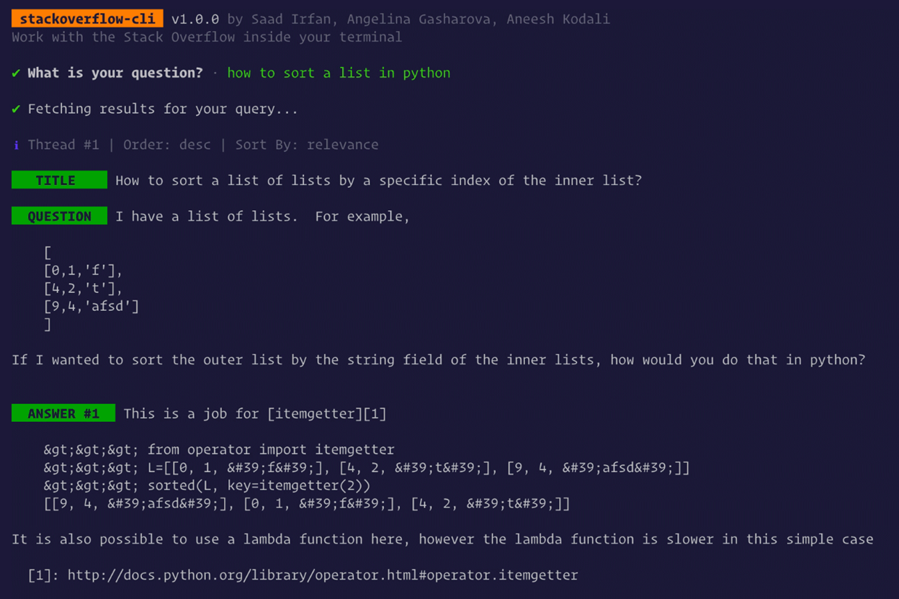
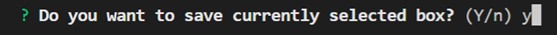
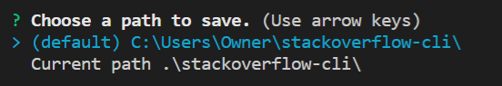
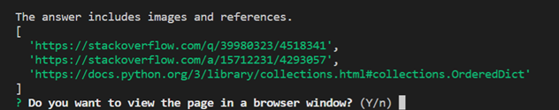
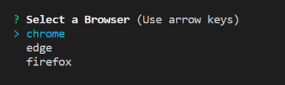

# 💥 stackoverflow-cli 사용자 가이드

**forked from [MLH-Fellowship/stackoverflow-cli](https://github.com/MLH-Fellowship/stackoverflow-cli)**

IDE를 종료하지 않고 **Stack Overflow**에서 원하는 질문을 검색하세요!

## 프로젝트 설명

터미널 상에서 질의응답 사이트를 통해 검색하고, 자동으로 원하는 답변을 저장하는 기능이 탑재된 CLI 형식의 검색 프로그램이다. 

해당 프로젝트는 stackoverflow-cli(https://github.com/MLH-Fellowship/stackoverflow-cli)에 기반을 두고 있으며 기존 기능 개선 및 새로운 기능을 추가하여 기존 프로젝트의 사용성을 개선시키는 방향으로 진행한다.   

## 기능

### 기존 기능 개선 

**1. 특수문자 출력 개선**

   다음은 stackoverflow-cli 실행 결과이다.



   ANSWER 부분을 보면 특수문자가 변환되지 않고 문자 엔티티 코드가 그대로 출력되고 있음을 확인할 수 있다. 따라서 특수문자 출력과정을 수정해 특수문자를 제대로 출력해 사용자가 내용을 더 잘 이해할 수 있도록 도왔다. 

**2. 출력 결과 개선**

   개발 질의/응답 사이트인 stackoverflow에서는 많은 사용자들이 질문 및 답변 작성 시 Inline code, Block code와 같은 형식을 사용해 주요 키워드를 표시하거나 코드를 작성한다. 따라서 터미널 상에서 질문 및 답변 출력 시 해당 형식을 구분할 수 있도록 출력 방식을 수정했다. 

### 추가 기능

**1. 선택한 질문 및 답변 저장 기능**

   같은 문제가 발생했을 때 이미 해결했더라도 이전의 해결 방법이 생각나지 않아 반복하여 검색하는 경우가 종종 있다. 이를 위해 질의 응답 사이트에서 검색한 질문 사항과 문제 해결에 사용한 해결 방안을 함께 저장하여 유사한 문제가 발생했을 때 활용할 수 있도록 한다. 

   키보드 방향키를 이용해 검색결과를 이동하면서 확인하다가 저장하기를 원하는 질문, 답변이 있다면 키보드 's'키 ('save'를 의미함)를 누른다.



   선택된 영역의 질문과 답변 내용을 선택할 것인지 확인한다.



   해당 내용을 텍스트 파일로 저장할 디렉토리 경로를 선택한다. 
   날짜와 질문으로 이루어진 파일명의 텍스트 파일이 저장된다.

**2. 내용에 이미지가 첨부된 경우 브라우저 자동 열림 기능**

   질문 및 답변에 이미지(혹은 참고 링크)가 첨부되는 경우, 기존 stackoverflow-cli 프로그램에서는 터미널 상에서 이미지 링크로 대체하여 제공한다. 이미지나 참고 링크 등이 포함된 게시글의 경우 브라우저 창을 실행시켜 해당 URL로 이동하여 사용자가 이미지가 포함된 글을 **Stack Overflow** 사이트에서 확인할 수 있도록 한다. 

   해당 프로젝트는 CLI 프로그램이므로 GUI 를 지원하지 않는 환경에서 사용할 가능성을 고려하여 이미지 또는 참고 링크가 포함된 글의 경우 사용자가 브라우저 창 실행을 원할 경우에만 기능을 실행되도록 한다. 

   키보드 방향키를 이용해 검색결과를 이동하면서 확인하다가 브라우저 창에서 페이지를 열어 보기를 원하는 질문, 답변이 있다면 키보드 'b'키 ('browser'를 의미함)를 누른다.

   해당 답변에 포함된 이미지 및 기타 링크들을 확인할 수 있다. 선택된 질문과 답변 내용을 브라우저 창에서 볼 것인지 확인한다.



   세 가지 웹 브라우저 중 이용할 브라우저 명을 선택한다.



## 사용 가이드

터미널 내에서 다음 명령어를 입력해 CLI 프로그램 실행

```sh
$ node index.js
```

### 📃사용방법

- 오른쪽 → 화살표 – 다음 질문
- 왼쪽 ← 화살표 – 이전 질문
- 위쪽 ↑ 화살표 – 다음 답변
- 아래쪽 ↓ 화살표 – 이전 답변
- 's' 키 - 선택한 질문 및 답변 저장
- 'b' 키 - 브라우저 창 실행

### 🏳 옵션

```
# CLI help 옵션
stack --help
```

[](https://github.com/yobinmok/stackoverflow-cli/blob/master/images/cli-help.png)

```
# 오름차순으로 결과 정렬
stack --asc

# 활동순으로 결과 정렬
stack --activity

# 추천순으로 결과 정렬
stack --votes

# 생성순으로 결과 정렬
stack --creation
```


